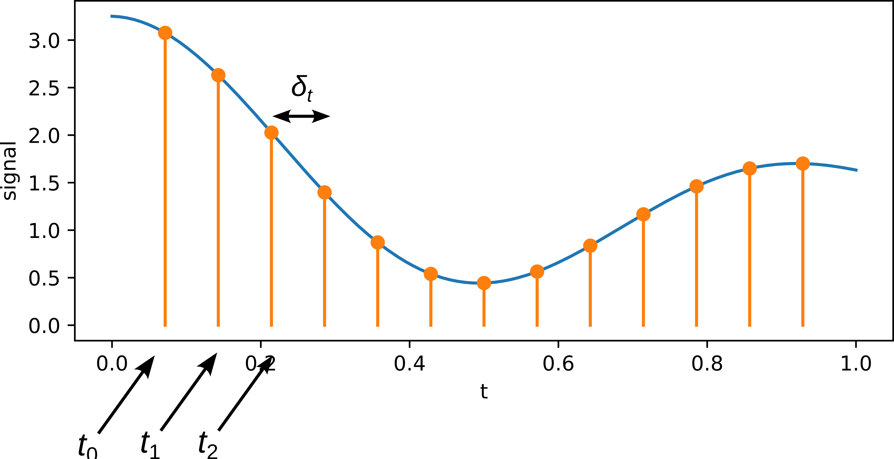
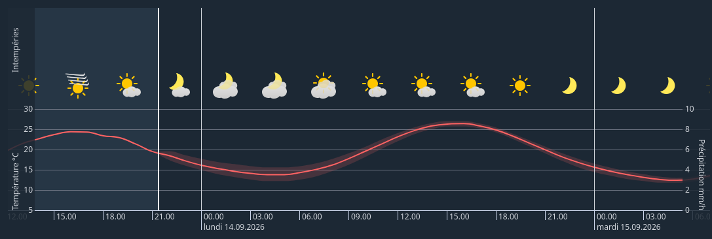
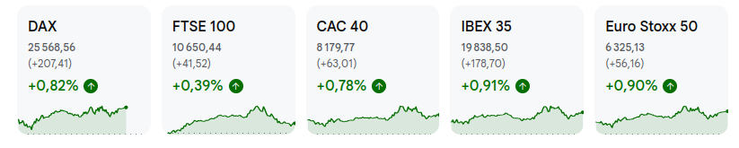
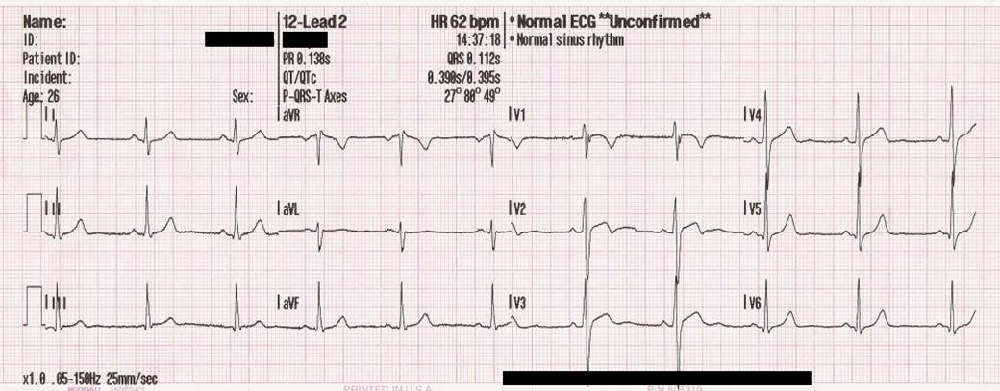

# Introduction to time series {.unnumbered}

[Slides](slides/week01/slides.html){.btn .btn-outline-primary .btn role="button"} 
[Slides PDF](slides/week01/slides.pdf){.btn .btn-outline-secondary .btn role="button"} 

## Definition of time series
According to you, what is a time series?

Two main ingredients:

1. Series: A "thing", usually measurable, i.e., a number.

1. Time: This number changes over time.

Formally, a time series is a sequence of values each indexed by a **time**:
$$ X = (x_{t_1}, x_{t_2},...,x_{t_N})\, ,$$
where $x_t$ is the value (usually a real number) of the time series at time $t$ and $t_1,t_2,...$ are the time steps. 
Each element $x_{t_i}$ of a time series is called a **sample**.

In general, there is no constraints on the time steps. 
But for this course, we will always consider times steps are evenly spaced. 
Therefore, we will skip the $t$ in the indexing and just number the components of the time series:
$$ X = (x_1,x_2,...,x_N)\, .$$
Note that we then have to specify the time of first recording and the **sampling rate**, i.e., the number of measurements per second. 



## Examples of time series
- Any meteorological quantity, measured over time (temperature, pressure, wind speed,...)



- Stock market prices



- Any quantity measured inside a [bioreactor](http://www.industrialpenicillinsimulation.com/) (temperature, pH,...)

- Any health constant measured on a patient (temperature, heart rate, blood pressure,...)




## Acquisition

### Time step
The acquisition of measurements requires the recording device to "read" the phenomenon and then "write" the recorded value.
By nature, a time series cannot be continuous, because there is necessarily a gap between two consecutive values. 
Depending on the context, however, this gap can be made extremely small.

In practice, the duration of a time step, or sampling rate, should be made as small as needed for the purpose, but as large as possible to spare memory and computation.

**Example:** 
*Recording sounds requires to sample at a frequency of approximately 20 kHz (largest audible frequency).
Actually, we need to record at twice this frequency because of aliasing (see later, Nyquist's Theorem).*

In this course, the time step of a time series will be denoted as $\delta_t$, measured in seconds.

### Recording time
Depending on the context, there is also a minimal recording time required in order to observe certain phenomena.

**Example:**
*In sound recording, if one does not record for more than 0.05 seconds, some audible sounds may not be recorded, because the lower bound of the audible spectrum is 20 Hz, i.e., 20 oscillations per second.*

In this course, the duration of a time series will be denoted $T$, measured in seconds.

## Resampling
Sometimes, the given time step of a time series is not appropriate for our purpose.

**Example:**
*I want to study the impact of the season on temperature. 
If the time step of my time series is at 15 minutes, this is too fine.* 

Given a fine time series, coarse graining is easy, but comes with a question.
For each coarser time step, I have multiple values measured. 
Which one(s) should I use?

**Example:**
What are my options for the example above?


## Representing
The first step in the analysis of a time series is visual inspection. 

Make sure to use an appropriate plotting tool. 
You need to be able to rescale, zoom in, zoom out of you time series. 

I recommend pyplot from matplotlib, which is a powerful plotting library. 

```{pyodide}
import matplotlib.pyplot as plt
import random

# Generate 12 random values
n = 12
t = list(range(1,n+1))
X = [random.random() for _ in range(n)]

# Plot as bullets
fig, ax = plt.figure(figsize=(8,5))
ax.plot(t, X, 'o')

ax.set_xlabel('t')
ax.set_ylabel('X')

plt.show()
```

## Noise

**Example:**
*Measure the height of someone in millimeters.*

Any data acquisition is imperfect. 
Deviations of the measurements from the "real" system's values are called **noise**. 
Noise is usually added (or substracted) from the measured values in the acquisition process. 

One goal in time series analysis will be to mitigate the impact of noise. 

In general, we will assume that the noise has zero mean. 
Therefore, the measured signal remains around the real signal.


## Hands-on

This [file](../files/penicillin-data-01.csv) contains a subset of the data simulated by this [Industrial-Scale Penicillin Simulator](http://www.industrialpenicillinsimulation.com/).

1. Read the description of the data set provided on the [simulator's website](http://www.industrialpenicillinsimulation.com/). 

1. Extract the data from the [file](../files/penicillin-data-01.csv) in a DataFrame format.

1. What is the time step $\delta_t$? What is the recording time $T$?

1. Choose one batch and one measured quantity, and plot the time series.

1. Resample the time series with time step of one hour and represent it on top of the original time series. How did you choose the value of the resampled time series?


