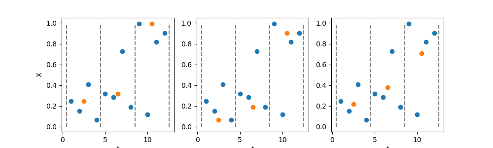

## Definition of time series
According to you, what is a time series?

## Definition of time series
According to you, what is a time series?

Two main ingredients:

1. **Series:** A "thing", usually measurable, i.e., a number.

1. **Time:** This number changes over time.

## Definition of time series
Formally, a time series is *a sequence of values each indexed by a time step*:
$$ X = (x_{t_1}, x_{t_2},...,x_{t_N})\, ,$$

- $x_t$: the value at time $t$

- $t_1,t_2,...$ are the **time steps**. 

Each element $x_{t_i}$ of a time series is called a **sample**.

## Time steps
For this course, we consider evenly spaced times steps.
$$ X = (x_1,x_2,...,x_N)\, .$$

But we have to specify:

- the time of first recording $t_0$

- the **sampling rate**, i.e., the time between two consecutive samples.


## Examples of time series
- Any meteorological quantity, measured over time (temperature, pressure,...)

- Stock market prices

- Any quantity measured inside a bioreactor (temperature, pH,...)

- Any health constant measured on a patient (temperature, heart rate,...)


## Acquisition - Time step
"Read" and "write" implies a gap between two consecutive values. 

The time step should be: 

- as large as possible...

- as small as necessary.
    
**Example:**
*Recording sounds requires $20\,000$ samples per second, i.e., $20 {\rm kHz}$.*

**Notation:** $\delta_t$

**Unit:** second


## Acquisition - Recording time
We cannot record for ever...

The recording time should be:

- as short as possible...

- as long as necessary.

**Example:**
*Recording a sound of less that $0.05 {\rm s}$, sounds at $20 {\rm Hz}$ cannot be heard.*

**Notation:** $T$

**Unit:** second

## Resampling
**Example:**
*I want to study the impact of the season on temperature.
If the time step of my time series is at 15 minutes, this it too fine.*



## Representing
Recommendation: pyplot from matplotlib.

```{pyodide}
import matplotlib.pyplot as plt
import random

# Generate 12 random values
n = 12
t = list(range(1,n+1))
X = [random.random() for _ in range(n)]

# Plot as bullets
plt.figure(figsize=(8,5))
plt.plot(t, X, 'o')

plt.xlabel('t')
plt.ylabel('X')

plt.show()
```

## Noise

**Example:** 
*Measure the height of someone in millimeters.*

## Noise

**Example:**
*Measure the height of someone in millimeters.*

Data acquisition is imperfect. 

Deviations from the "real" value are the **noise**. 

**Goal:** Mitigate the effect of noise.


## Hands-on

See [webpage](https://dls.hevs.ch/ts/week01/).


