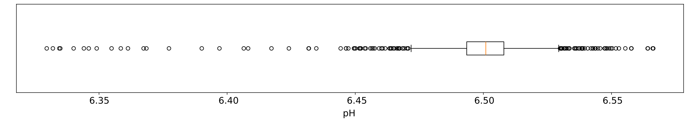
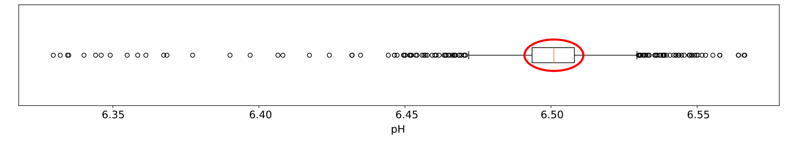
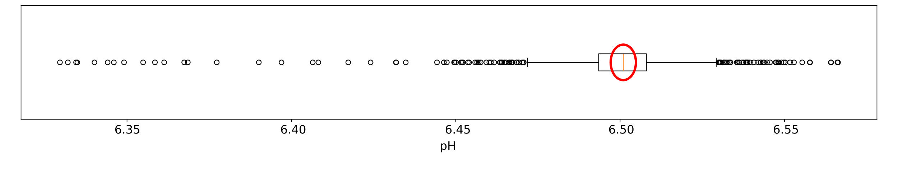
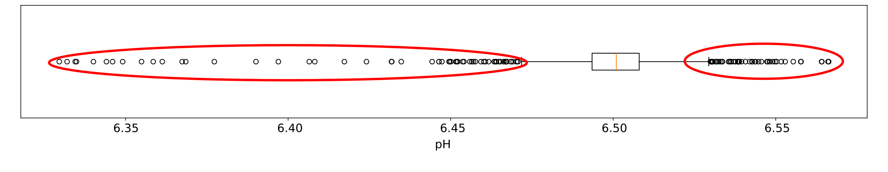
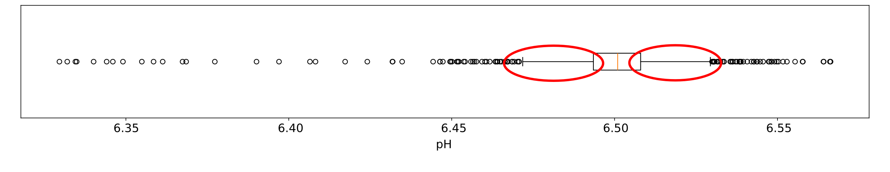

## Statistics
**Goal:** Provide a summarized description of a (large) set of values.

**Strength:** Readable by a human.

**Weakness:** Necessarily partial and biased.


## Example data set {.smaller}

We will again use our [bioreactor time series](../files/penicillin-data-01.csv)

```{=html}
<style>
talbe.dataframe { font-size: 0.5em !important; }
</style>
```

```{pyodide}
import pandas as pd

data = pd.read_csv('https://dls.hevs.ch/ts/files/penicillin-data-01.csv')
data.describe()
```

## Example data set
We will again use our [bioreactor time series](../files/penicillin-data-01.csv)

```{pyodide}
subdata = data.loc[data["Batch ID"]==2,"pH(pH:pH)"]
subdata.describe()
```

## Example data set
We will again use our [bioreactor time series](../files/penicillin-data-01.csv)

```{pyodide}
import matplotlib.pyplot as plt

ax = subdata.hist(bins=50)
ax.set_xlabel("pH")
ax.set_ylabel("occurence")

plt.show()
```


## Mean
The **mean** of $X = (x_0,x_1,x_2,...,x_{N-1})$ is
$$ \mathrm{mean}(X) = \mu_X = \langle X\rangle = \frac{1}{N}\sum_{i=0}^{N-1}x_i\, .$$

**Strength:** Basic and intuitive.

**Weakness:** Sensitive to extreme values.

## Variance

The **variance** measures dispersion of the data: 
$$\mathrm{var}(X) = \sigma_X^2 = \langle (X - \langle X\rangle)^2\rangle = \frac{1}{N}\sum_{i=0}^{N-1} \left(x_i - \mu_X\right)^2\, .$$

The square root of the variance is the **standard deviation**.

## Mean and variance

```{pyodide}
import numpy as np

mu = subdata.describe()["mean"]
sig = subdata.describe()["std"]

ax = subdata.hist(bins=50)

max_val = np.histogram(subdata,bins=50)[0].max()
ax.plot([mu,mu],[0,1.1*max_val],"--",color="C1",lw=2)
ax.fill([mu-sig,mu+sig,mu+sig,mu-sig],[0,0,1.1*max_val,1.1*max_val],color="C1",alpha=.2)

ax.set_xlabel("pH")
ax.set_ylabel("occurence")

plt.show()
```


## Median
The **median** represents the "middle" of the data set.

Computing: 

1. Sort the elements of $X$.

1. If $N$ is odd, then $\mathrm{median}(X) = x_{(N-1)/2}$.

1. If $N$ is even, then $\mathrm{median}(X) = (x_{N/2-1}+x_{N/2})/2$.

## Quantiles
**Quantiles** generalize the notion of median.

Let $\rho\in[0,1]$. 
The $\rho$-th quantile of $X$, written $q_\rho(X)$ is the value that is larger than a proportion $\rho$ of the samples.

## Median and quantiles

```{pyodide}
import numpy as np

ax = subdata.hist(bins=50)

q00 = subdata.describe()["min"]
q25 = subdata.describe()["25%"]
q50 = subdata.describe()["50%"]
q75 = subdata.describe()["75%"]
q100 = subdata.describe()["max"]
max_val = np.histogram(subdata,bins=50)[0].max()

ax.plot([q50,q50],[0,1.1*max_val],"--",color="C2",lw=2)
ax.fill([q25,q75,q75,q25],[0,0,1.1*max_val,1.1*max_val],color="C2",alpha=.2)
ax.fill([q00,q100,q100,q00],[0,0,1.1*max_val,1.1*max_val],color="C2",alpha=.05)

ax.set_xlabel("pH")
ax.set_ylabel("occurence")

plt.show()
```

## Median and quantiles

In particular,

- $q_{0.5}(X) = \mathrm{median}(X)$

- $q_{0}(X) = \mathrm{min}(X)$

- $q_{1}(X) = \mathrm{max}(X)$

## Quartiles

The quantiles $(q_0, q_{0.25}, q_{0.5}, q_{0.75}, q_1)$ are called **quartiles**.

The difference $q_{0.75}-q_{0.25}$ is the **interquartile range (IQR)**.

## Percentiles

The quantiles $(q_0, q_{0.01}, q_{0.02},..., q_{0.99}, q_1)$ are the **percentiles**.

They divide the samples into 100 groups of same cardinality.


## Box plot



*[[John Tukey](https://en.wikipedia.org/wiki/John_Tukey), [Mary Eleanor Spear](https://en.wikipedia.org/wiki/Mary_Eleanor_Spear)]*.

**Strength:** A lot of information, compact.

## Box plot - IQR



A rectangle (the box itself) filling the space between the first ($q_{0.25}$) and third ($q_{0.75}$) quartiles.

## Box plot - Median



A line at the median of the sample.

## Box plot - Outliers



Dots at **outlier** values: values that are larger than $q_{0.75}+1.5\cdot\mathrm{IQR}$ (resp. smaller than $q_{0.25}-1.5\cdot\mathrm{IQR}$).

## Box plot - Whiskers 



Whiskers from the box to the largest sample value that is smaller than $q_{0.75}+1.5\cdot\mathrm{IQR}$ (resp. larger than $q_{0.25}-1.5\cdot\mathrm{IQR}$).

## Box plot

```{pyodide}
fig, (ax1,ax2) = plt.subplots(nrows=2, sharex=True, gridspec_kw={'height_ratios': (1,4)})

ax1.boxplot(subdata, vert=False, widths=.6)
ax1.set(yticks=[])

ax2.hist(subdata, bins=50)

ax1.spines['bottom'].set_visible(False)
ax1.tick_params(bottom=False)
ax2.spines['top'].set_visible(False)

plt.tight_layout()
plt.show()
```

## Covariance
Two time series $X$ and $Y$ with **same time steps**. 

Their **covariance**
$$ \mathrm{cov}(X,Y) \langle(X - \mu_X)(Y - \mu_Y)\rangle = \frac{1}{N}\sum_{i=0}^{N-1} \left(x_i - \mu_X\right)\left(y_i - \mu_Y\right)\, . $$

The larger the covariance, the more similar the time series.

If the time series have zero-mean, 
$$ \mathrm{cov}(X,Y) = \frac{1}{N}\sum_{i=0}^{N-1}x_iy_i\, .$$

## Covariance

```{pyodide}
data.cov()
```

## Correlation

Covariances are difficult to compare between time series. 

The **correlation** considers normalized time series.

The **Pearson correlation coefficient** of $X$ and $Y$ is
$$ r_{XY} = \frac{\sum_{i=0}^{N-1}(x_i-\mu_X)(y_i-\mu_Y)}{\sqrt{\sum_{i=0}^{N-1}(x_i-\mu_X)^2}\sqrt{\sum_{i=0}^{N-1}(y_i-\mu_Y)^2}} = \frac{\mathrm{cov}(X,Y)}{\sigma_X\sigma_Y}\, .$$

## Correlation
The correlation takes value between $-1$ and $1$.

$r=1$ means perfect correlation.

$r=-1$ means perfect anticorrelation.

$r=0$ means no correlation.


## Correlation

```{pyodide}
r = data.corr()
print(r)

fig, ax = plt.subplots()
rax = ax.matshow(r, cmap='coolwarm', vmin=-1, vmax=1)
fig.colorbar(rax)

ax.set_yticks(range(len(r.columns)))
ax.set_yticklabels(r.columns)

plt.show()
```


## Hands-on

See [webpage](https://dls.hevs.ch/ts/week02/).


