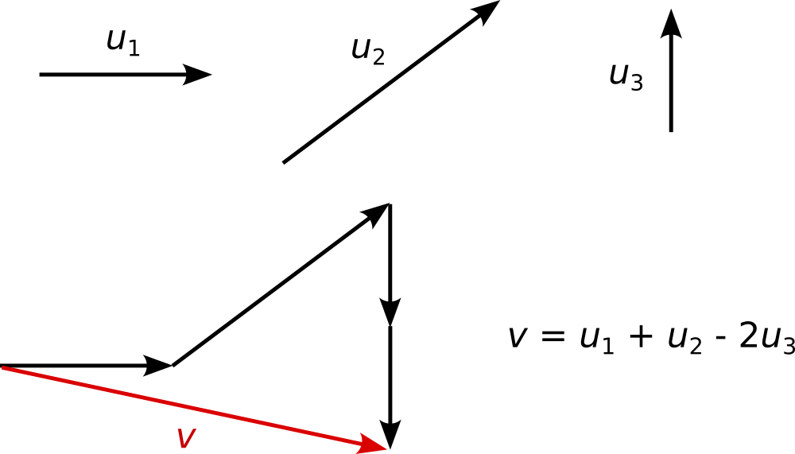

# Recap of vectorial geometry {.unnumbered}

[Slides](slides/week05/slides.html){.btn .btn-outline-primary .btn         role="button"}
[Slides PDF](slides/week05/slides.pdf){.btn .btn-outline-secondary .btn    role="button"}

One way to make sense of the tools we will be using in this class is by considering time series as (very) high-dimensional vectors. 
If a time series is composed of $N$ time steps, i.e., it is a sequence of $N$ numbers, then it can be seen as a vector in $\mathbb{R}^N$.

## Vectors
A $N$-dimensional **vector** $\vec{v}$ is an arrow in $\mathbb{R}^N$, i.e., it is characterized by:

- A direction: the line supporting the arrow,

- A orientation: the way the arrow's head points to,
	
- A magnitude: the length of the arrow, called the **norm**, computed as
$$\|\vec{v}\| = \sqrt{v_1^2 + v_2^2 + \cdots + v_N^2} = \sqrt{\sum_{i=1}^{N}v_i^2}\, .$$

{width=10%, fig-align="center"}

A vector is said to be **normalized** if it has norm 1. 
A vector can be normalized by dividing it by its own norm. 
Let $\vec{v}$ be any vector, then the vector
$$ \vec{u} = \frac{1}{\|\vec{v}\|}\vec{v}\, , $$
is normalized. 

A vector is typically represented by the coordinates of its head when its tail lies on at the origin.
We typically write a vector as a 1-column matrix, whose components are the coordinates.

{width=1%, fig-align="center"}

One of the fundamental properties of vectors is that a **linear combination** of vectors 
$$\vec{v} = \alpha_1\vec{v}_1 + \alpha_2\vec{v}_2 + \alpha_3\vec{v}_3\, ,$$
is itself a vector.

{width=60%, fig-align="center"}

## Basis
A **basis** of $\mathbb{R}^N$ is a very specific set of vectors, 
$$ \mathcal{B} = \left\{\vec{u}_1,\vec{u}_2,...,\vec{u}_n\right\}\, .$$
A basis satisfies at two conditions:

1. **Independence**: None of the vectors $\vec{u}_i\in\mathcal{B}$ can be created as a linear combination of the $N-1$ others.

1. **Generative**: A basis of $\mathbb{R}^N$ is composed of precisely $N$ vectors.

**TODO:    Examples:...**

Any vector can be written in a given basis (i.e., as a linear combination of the basis' elements) in unique fashion.
In other words, given any vector $\vec{v}\in\mathbb{R}^N$, there exists a unique choice of coefficients $\{\alpha_1,...,\alpha_N\}\subset\mathbb{R}$ such that 
$$\vec{v} = \alpha_1\vec{u}_1 + \alpha_2\vec{u}_2 + \cdots + \alpha_N\vec{u}_N\, .$$

## Scalar product
The **scalar product** of two vectors $\vec{x}$ and $\vec{y}$ can be computed as 
$$\vec{x}\cdot\vec{y} = \sum_{i=1}^{N}x_iy_i\, .$$
One can prove that the scalar product can equivalently be computed as 
$$\vec{x}\cdot\vec{y} = \|\vec{x}\|\cdot\|\vec{y}\|\cdot\cos(\phi)\, ,$$
where $\phi\in[-\pi,\pi]$ is the angle between the two vectors $\vec{x}$ and $\vec{y}$.

In particular, one realizes that two vectors are colinear with identical (resp. opposite) orientation if and only if $\cos(\phi)=1$ (resp. $\cos(\phi)=-1$). 
Furthermore, two vectors are orthogonal (perpendicular) if and only if their scalar product is zero.

Finally, taking the scalar product between a vector $\vec{v}$ and itself gives the squared norm of $\vec{v}$, 
$$ \vec{v}\cdot\vec{v} = \|\vec{v}\|^2\, .$$

## Orthogonal projection
The **orthogonal projection** of a vector $\vec{v}$ on another vector $\vec{u}$ is the best approximation of $\vec{v}$ by a vector colinear to $\vec{u}$. 

**TODO: Illustrate the orthogonal projection.**

The projected vector $\vec{v}_{\vec{u}}$ is computed as
$$ \vec{v}_{\vec u} = \frac{\vec{v}\cdot\vec{u}}{\|\vec{u}\|^2}\vec{u}\, .$$

## Orthonormal basis
A basis ${\cal B}=\{\vec{u}_1,\vec{u}_2,...,\vec{u}_N\}$ is **orthonormal** if:

1. Each vector $\vec{u}_i$ is normalized, i.e., $\|\vec{u}_i\|^2 = \vec{u}_i\cdot\vec{u}_i = 1$; and

1. All the vectors $\vec{u}_i$, $\vec{u}_j$ are orthogonal, i.e., $\vec{u}_i\cdot\vec{u}_j = 0$.

Recall that any vector $\vec{v}$ can be written as a linear combination of the basis vectors, 
$$ \vec{v} = \alpha_1\vec{u}_1 + \alpha_2\vec{u}_2 + \cdots + \alpha_N\vec{u}_N\, . $$
With an orthonormal basis, the term $\alpha_i\vec{u}_i$ is the orthogonal projection of $\vec{v}$ onto $\vec{u}_i$, 
$$ \alpha_i\vec{u}_i = \frac{\vec{v}\cdot\vec{u}_i}{\|\vec{u}_i\|^2}\vec{u}_i\, . $$
Therefore, 
$$ \alpha_i = \frac{\vec{v}\cdot\vec{u}_i}{\|\vec{u}_i\|^2} = \vec{v}\cdot\vec{u}_i\, .$$

## Change of basis
Notice that stacking each vector $\vec{u}_i$ as a row of a $N\times N$ matrix 
$$ U = \begin{pmatrix} \cdots & \vec{u}_1 & \cdots \\
\cdots & \vec{u}_2 & \dots \\
& \vdots & \\
\cdots & \vec{u}_N & \cdots \end{pmatrix}\, , $$
then computing the product $U\cdot\vec{v}$, we get
$$ U\cdot \vec{v} 
= \begin{pmatrix} \cdots & \vec{u}_1 & \cdots \\
\cdots & \vec{u}_2 & \dots \\
& \vdots & \\
\cdots & \vec{u}_N & \cdots \end{pmatrix} \cdot \begin{pmatrix} \vdots \\ \vec{v} \\ \vdots \end{pmatrix} 
= \begin{pmatrix} \vec{u}_1\cdot\vec{v} \\ \vec{u}_2\cdot\vec{v} \\ \vdots \\ \vec{u}_N\cdot\vec{v}\end{pmatrix} 
= \begin{pmatrix}\alpha_1 \\ \alpha_2 \\ \vdots \\ \alpha_N \end{pmatrix}\, .$$
This means that the matrix $U$ allowed us to write the vector $\vec{v}$ in the coordinates of the basis $\mathcal{B}$. 

## Vectorial interpretation of the covariance and correlation
The time series $X$ and $Y$ can be seen as $N$-dimensional vectors, that we will write as $\vec{x}$ and $\vec{y}$ respectively.
From this point of view, we notice that the covariance is the scalar product of the two vectors and the correlation is the scalar product of the same two vectors, normalized to have norm 1.

Let us assume that $X$ and $Y$ have zero mean. 
Hence, their covariance is computed exactly as the scalar product,
$$ \mathrm{cov}(X,Y) = \sum_{i=0}^{N-1}x_iy_i = \vec{x}\cdot\vec{y}\, .$$

Furthermore, normalizing $\vec{x}$ and $\vec{y}$, and taking their scalar product yields exactly the Pearson correlation,
$$ \left(\frac{\vec{x}}{\|\vec{x}\|}\right)\cdot\left(\frac{\vec{y}}{\|\vec{y}\|}\right) = \frac{\vec{x}\cdot\vec{y}}{\|\vec{x}\|\, \|\vec{y}\|} = \frac{\sum_{i=0}^{N-1}x_iy_i}{\sqrt{\sum_{i=0}^{N-1}x_i^2}\sqrt{\sum_{i=0}^{N-1}y_i^2}} = r_{XY}\, .$$

## Hands on

