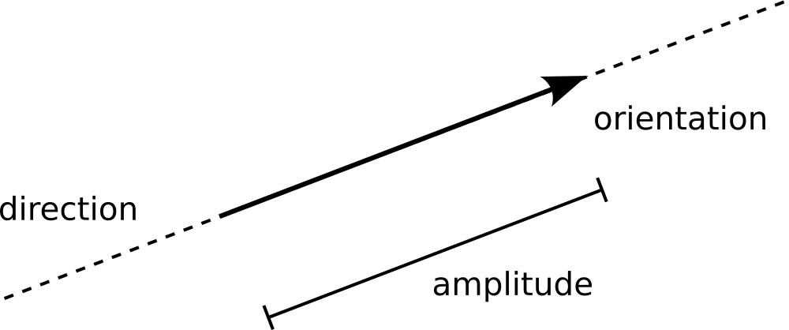
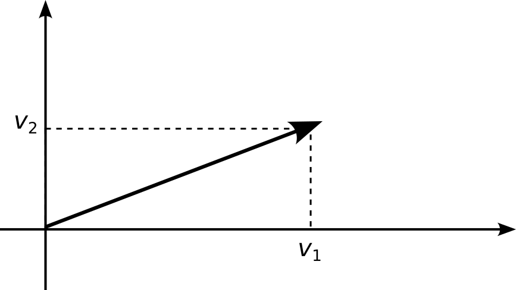
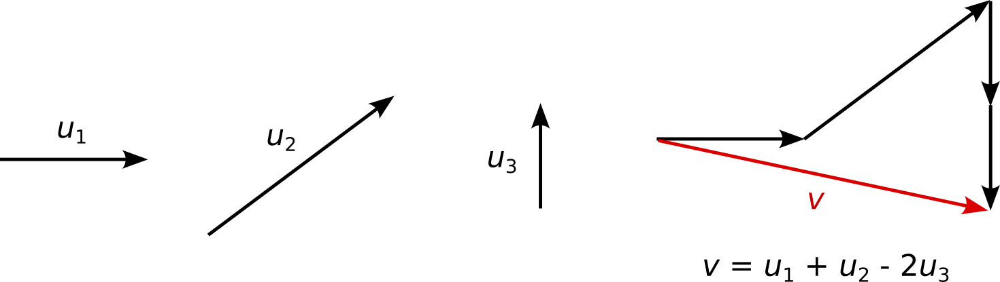
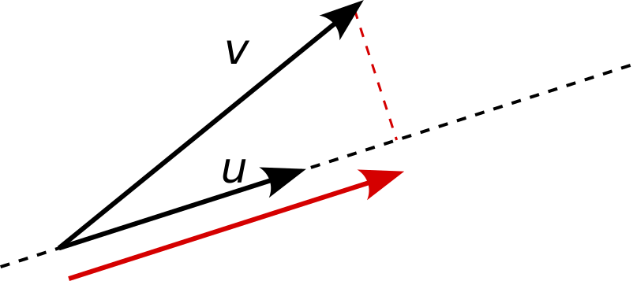
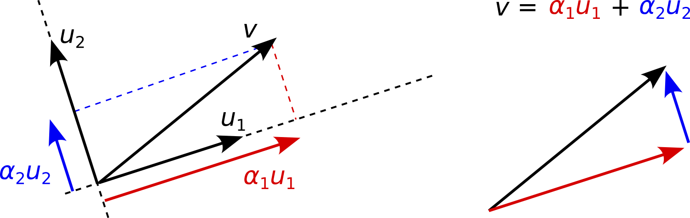

## Introductory remark
A time series $X$ composed of $N$ time steps

$\iff$

A sequence of $N$ numbers

$\iff$

A vector in $\mathbb{R}^N$.

## Vectors
A $N$-dimensional **vector** $\vec{v}$ is an arrow in $\mathbb{R}^N$:

- A direction: the line supporting the arrow,

- A orientation: the way the arrow's head points to,
	
- A magnitude: the length of the arrow, called the **norm**, computed as
<!--$$\|\vec{v}\| = \sqrt{v_1^2 + v_2^2 + \cdots + v_N^2} = \sqrt{\sum_{i=1}^{N}v_i^2}\, .$$-->



## Normalization
A vector is **normalized** if $\|\vec{v}\| = 1$. 

If 
$$ \vec{u} = \frac{1}{\|\vec{v}\|}\vec{v}\, , $$
then
$$\|\vec{u}\| = 1\, .$$
 
## Coordinates
Tail at the origin and coordinates of the head.



## Linear combination
A **linear combination** of vectors 
$$\vec{v} = \alpha_1\vec{v}_1 + \alpha_2\vec{v}_2 + \alpha_3\vec{v}_3\, ,$$
is itself a vector.



## Basis
A **basis** of $\mathbb{R}^N$ is a very set of vectors, 
$$ \mathcal{B} = \left\{\vec{u}_1,\vec{u}_2,...,\vec{u}_n\right\}\, ,$$
such that:

1. **Independence**: None of the vectors $\vec{u}_i\in\mathcal{B}$ can be created as a linear combination of the $N-1$ others.

1. **Generative**: A basis of $\mathbb{R}^N$ is composed of precisely $N$ vectors.

## Example

The vectors
$$\vec{u}_1 = \begin{pmatrix}1\\0\\0\end{pmatrix}\, , \qquad
\vec{u}_2 = \begin{pmatrix}0\\1\\0\end{pmatrix}\, , \qquad
\vec{u}_3 = \begin{pmatrix}0\\0\\1\end{pmatrix}\, , \qquad
\vec{u}_4 = \begin{pmatrix}1\\1\\1\end{pmatrix}\, ,$$
are not linearly independent: $\vec{u}_4 = \vec{u}_1+\vec{u}_2+\vec{u}_3$. 

## Example

The vectors
$$\vec{u}_1 = \begin{pmatrix}1\\1\\0\end{pmatrix}\, , \qquad
\vec{u}_2 = \begin{pmatrix}0\\1\\1\end{pmatrix}\, ,$$
are linearly independent, but not generative:
$$\vec{v} = \begin{pmatrix}1\\1\\-1\end{pmatrix}\, ,$$
cannot be written as a linear combination of $\vec{u}_1$ and $\vec{u}_2$.

## Basis (cont'd)
Given any vector $\vec{v}\in\mathbb{R}^N$,
$$\vec{v} = \alpha_1\vec{u}_1 + \alpha_2\vec{u}_2 + \cdots + \alpha_N\vec{u}_N\, .$$

This choice of $\alpha$'s is unique.

## Scalar product
The **scalar product** of $\vec{x}$ and $\vec{y}$ is 
$$\vec{x}\cdot\vec{y} = \sum_{i=1}^{N}x_iy_i\, .$$

Equivalent form:
$$\vec{x}\cdot\vec{y} = \|\vec{x}\|\cdot\|\vec{y}\|\cdot\cos(\phi)\, ,$$
where $\phi\in[-\pi,\pi]$ is the angle between $\vec{x}$ and $\vec{y}$.

## Scalar product (cont'd)
If $\vec{x}$ and $\vec{y}$ are collinear, then $\cos(\pm\phi)=\pm1$. 

If $\vec{x}$ and $\vec{y}$ are perpendicular (orthogonal), then $\vec{x}\dot\vec{y}=0$. 

Finally, $\vec{v}\cdot\vec{v} = \|\vec{v}\|^2$.

## Orthogonal projection

The **orthogonal projection** of $\vec{v}$ on $\vec{u}$ is
$$\vec{v}_{\vec u} = \frac{\vec{v}\cdot\vec{u}}{\|\vec{u}\|^2}\vec{u}\, .$$

{.any_class width="40%"}


## Orthonormal basis
A basis $\mathcal{B}=\{\vec{u}_1,\vec{u}_2,...,\vec{u}_N\}$ is **orthonormal** if:

1. $\|\vec{u}_i\|^2 = \vec{u}_i\cdot\vec{u}_i = 1$ for all $i\in\{1,...,N\}$; and

1. $\vec{u}_i\cdot\vec{u}_j = 0$ for all $i\neq j$.

## Orthonormal basis (cont'd)
For any vector $\vec{v}$, 
$$ \vec{v} = \alpha_1\vec{u}_1 + \alpha_2\vec{u}_2 + \cdots + \alpha_N\vec{u}_N\, . $$

With an orthonormal basis, the coefficients are 
$$ \alpha_i = \frac{\vec{v}\cdot\vec{u}_i}{\|\vec{u}_i\|^2} = \vec{v}\cdot\vec{u}_i\, .$$



## Change of basis
Let us define the $N\times N$ matrix 
$$ U = \begin{pmatrix} \cdots & \vec{u}_1 & \cdots \\
\cdots & \vec{u}_2 & \dots \\
& \vdots & \\
\cdots & \vec{u}_N & \cdots \end{pmatrix}\, . $$

## Change of basis (cont'd)
The product
$$ U\cdot \vec{v} 
= \begin{pmatrix} \cdots & \vec{u}_1 & \cdots \\
\cdots & \vec{u}_2 & \dots \\
& \vdots & \\
\cdots & \vec{u}_N & \cdots \end{pmatrix} \cdot \begin{pmatrix} \vdots \\ \vec{v} \\ \vdots \end{pmatrix} 
= \begin{pmatrix} \vec{u}_1\cdot\vec{v} \\ \vec{u}_2\cdot\vec{v} \\ \vdots \\ \vec{u}_N\cdot\vec{v}\end{pmatrix} 
= \begin{pmatrix}\alpha_1 \\ \alpha_2 \\ \vdots \\ \alpha_N \end{pmatrix}\, . $$
gives the coordinates of $\vec{v}$ in $\mathcal{B}$. 


## Vectorial interpretation of the covariance and correlation
The time series $X$ and $Y$ are $N$-dimensional vectors, written $\vec{x}$ and $\vec{y}$ respectively.

Then, 
$$\mathrm{covariance} = \vec{x}\dot\vec{y}$$
and 
$$\mathrm{correlation} = \frac{\vec{x}}{\|\vec{x}\|}\dot\frac{\vec{y}}{\|\vec{y}\|}$$

## Illustration
Let $x$ and $y$ be two time series / vectors:
```{pyodide}
import numpy as np
import matplotlib.pyplot as plt

t = np.linspace(0,10,200)

x = np.random.uniform()*np.sin(t) + np.random.uniform()*np.cos(2*t) + np.random.uniform()*np.sin(3*t)
y = np.random.uniform()*np.cos(t) + np.random.uniform()*np.sin(2*t) + np.random.uniform()*np.cos(3*t)

r = np.dot(x,y)/(np.linalg.norm(x)*np.linalg.norm(y))

print(f'r = {r}')

fig, ax = plt.subplots(figsize=(7,3))

ax.plot(t,x,'.')
ax.plot(t,y,'.')

ax.set_xlabel('t')
ax.set_title(f'r = {r}')

plt.show()
```

## Illustration
Let $z = \gamma x + (1-\gamma) y\, ,$

```{pyodide}
gamma = .5

z = gamma*x + (1-gamma)*y

r = np.dot(x,z)/(np.linalg.norm(x)*np.linalg.norm(z))
print(f'r = {r}')

fig, ax = plt.subplots(figsize=(7,3))

ax.plot(t,x,'.')
ax.plot(t,z,'.')

ax.set_xlabel('t')
ax.set_title(f'r = {r}')

plt.show()
```


## Hands on

See [webpage](https://dls.hevs.ch/ts/week05).

